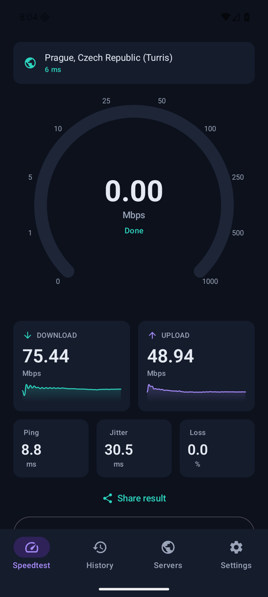
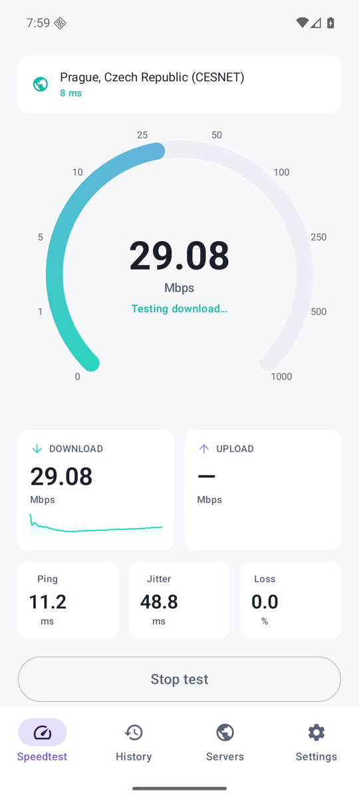
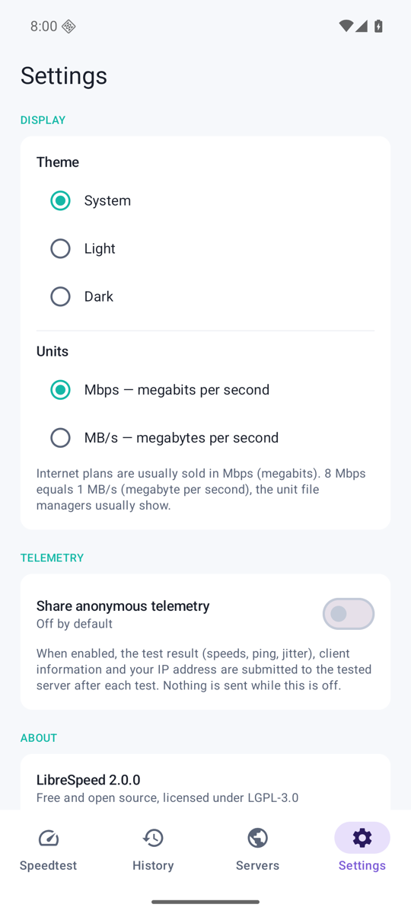

<picture>
  <source media="(prefers-color-scheme: dark)" srcset=".github/logo-dark.png">
  
</picture>

# LibreSpeed for Android

Free and open source internet speed test for Android — no ads, and no tracking by default; optional telemetry is explicitly opt-in.

LibreSpeed measures your connection against community-run [LibreSpeed](https://github.com/librespeed/speedtest) servers, or against your own self-hosted one.

<p>
  
  
  
</p>

## Features

* Download, upload, ping, jitter and approximate packet loss
* IPv4 and IPv6
* Server selection with favorites and custom self-hosted servers; a bundled
  snapshot of the public server list is used as fallback when the remote list
  cannot be loaded
* Test history with sharing
* Material 3 design, dark and light theme, large screen support
* Telemetry strictly opt-in (off by default)

## Compatibility

Android 8.0 and up (minSdk 26), targets Android 16 (API 36).

## Building

The project lives in `Speedtest-Android/`:

```
cd Speedtest-Android
./gradlew :app:assembleDebug
```

Release builds are produced by the GitHub Actions workflow on tags (`v*`) and require the `SIGNING_*` repository secrets — the release job fails rather than shipping a debug-signed build. The signed APK is attached to the GitHub release (Obtainium-friendly); the AAB for Play submission is kept as a workflow artifact only.

## Privacy & security

See [PRIVACY.md](PRIVACY.md) and [SECURITY.md](SECURITY.md). The app requests the INTERNET permission only.

## License

LGPL-3.0, same as the rest of the LibreSpeed project.
